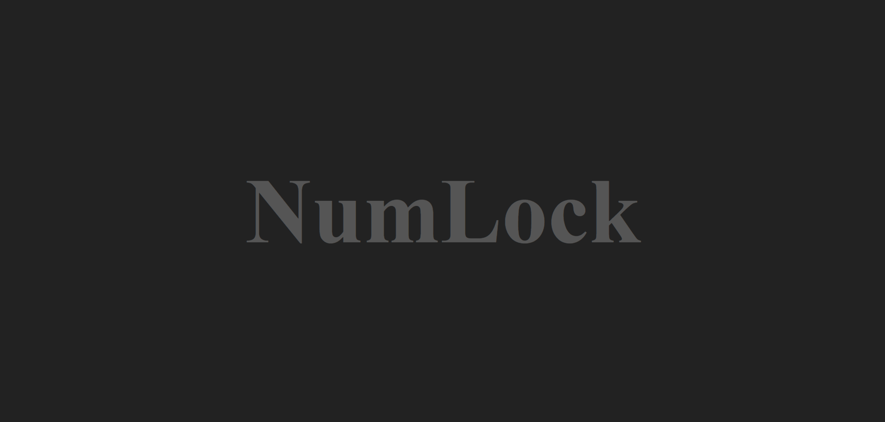
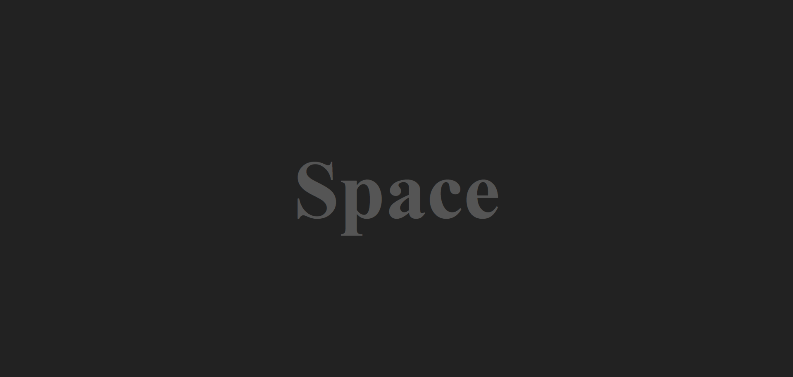
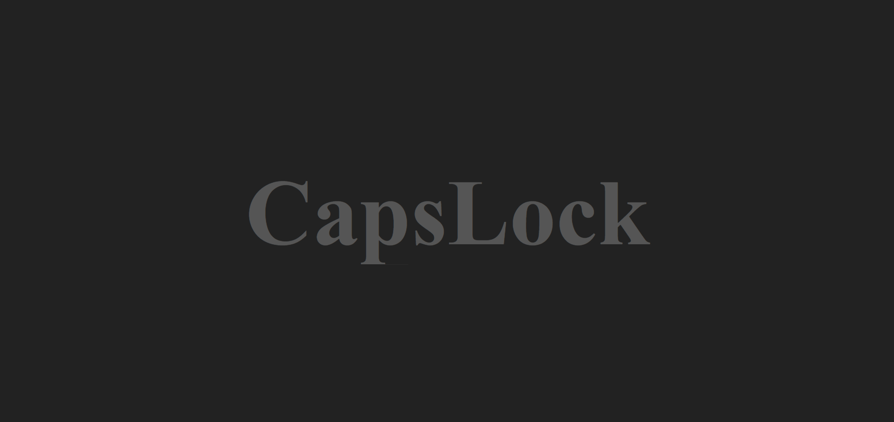

# JavaScript Keyboard Event Detector

A simple beginner-friendly JavaScript project that detects keyboard key presses and displays the pressed key on the screen.
This project was created to practice **JavaScript DOM manipulation and keyboard events**.

## 🚀 Live Demo
https://manojmadke.github.io/javascript-keyboard-event-detector/

## 📸 Screenshots

These screenshots show the actual project running in the browser.

### NumLock Key


### Space Key


### CapsLock Key


## ⚠️ Instruction

Press any key on your keyboard and the webpage will display the key you pressed.

For example:

* Press `A` → displays `a`
* Press `Enter` → displays `Enter`
* Press `ArrowUp` → displays `ArrowUp`
* Press `Space` → displays `Space`

## 🛠️ Technologies Used

* HTML5
* CSS3
* JavaScript

## 📚 Learning Topics

While building this project, I practiced:

* DOM Manipulation
* `document.querySelector()`
* `addEventListener()`
* Keyboard Events
* `keydown` Event
* Event Object
* `event.key`
* Conditional Statements
* Changing HTML content using `textContent`

## ⚙️ How It Works

The JavaScript selects the `<h1>` element from the HTML:

```javascript
let h1 = document.querySelector("h1");
```

Then a `keydown` event listener detects when the user presses a key:

```javascript
window.addEventListener("keydown", function(dets) {
    if (dets.key === " ") {
        h1.textContent = "Space";
    } else {
        h1.textContent = dets.key;
    }
});
```

The `event.key` property gives the name or value of the key that was pressed, which is then displayed on the webpage.

## 🎯 Project Objective

The main objective of this project was to understand how JavaScript can interact with user keyboard input and dynamically update webpage content.

## 💡 Future Improvements

Some features that can be added in the future:

* Show keyboard key code
* Show `event.code`
* Display key name and key code together
* Add a virtual keyboard UI
* Add animations when a key is pressed
* Improve responsive design
* Add dark/light mode

## 👨‍💻 Author

**Manoj Madke**

Learning and building projects while improving my JavaScript and Full Stack Development skills.
